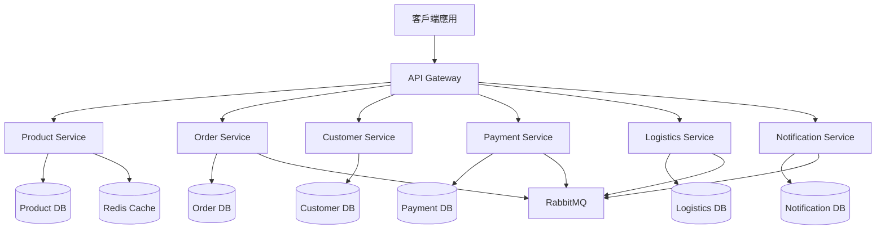

# 電商多微服務系統設計文件

## 概述

本系統採用微服務架構，基於領域驅動設計（DDD）和六角形架構（Hexagonal Architecture）原則，嚴格遵循 SOLID 設計原則。使用 Java 17 和 Spring Boot 3 作為主要技術棧，實現測試驅動開發（TDD）和行為驅動開發（BDD）。

## SOLID 設計原則應用

### S - Single Responsibility Principle (單一職責原則)
- 每個微服務只負責一個業務領域
- 每個類別只有一個變更的理由
- 分離關注點：控制器、服務、倉儲各司其職

### O - Open/Closed Principle (開放封閉原則)  
- 使用介面和抽象類別實現擴展性
- 策略模式處理不同付款方式
- 工廠模式創建不同類型的通知

### L - Liskov Substitution Principle (里氏替換原則)
- 所有實作類別可以替換其介面
- 子類別不改變父類別的行為契約
- 多型實現不同的配送策略

### I - Interface Segregation Principle (介面隔離原則)
- 細粒度的介面設計，避免胖介面
- 客戶端不依賴不需要的介面
- 分離讀寫操作介面

### D - Dependency Inversion Principle (依賴反轉原則)
- 高層模組不依賴低層模組
- 依賴注入實現鬆耦合
- 使用介面定義依賴關係

## 技術棧

- **語言**: Java 17
- **框架**: Spring Boot 3.x
- **建構工具**: Gradle 8.x
- **測試框架**: JUnit 5, Spring Boot Test, Cucumber (BDD)
- **API 文件**: Swagger/OpenAPI 3
- **資料庫**: MySQL 8.0 (主要), Redis (快取)
- **訊息佇列**: RabbitMQ
- **服務發現**: Spring Cloud Gateway
- **監控**: Spring Boot Actuator, Micrometer

## 系統架構

### 整體架構圖



### 核心微服務架構

每個微服務都採用完整的六角形架構，包含領域層、應用層和基礎設施層：

#### 1. API Gateway
- **職責**: 統一入口、路由、認證、限流、監控
- **技術**: Spring Cloud Gateway
- **端口**: 8080

#### 2. Customer Service (客戶微服務)
- **職責**: 客戶資料管理、地址管理、客戶認證
- **端口**: 8081
- **資料庫**: customer_db
- **六角形架構**:
  ```
  customer-service/
  ├── domain/
  │   ├── model/Customer.java
  │   ├── repository/CustomerRepository.java
  │   └── service/CustomerDomainService.java
  ├── application/
  │   ├── port/in/CustomerUseCase.java
  │   ├── port/out/CustomerPersistencePort.java
  │   └── usecase/CustomerService.java
  └── infrastructure/
      ├── adapter/web/CustomerController.java
      ├── adapter/persistence/CustomerJpaAdapter.java
      └── config/CustomerConfig.java
  ```

#### 3. Product Service (商品微服務)
- **職責**: 商品管理、庫存管理、商品搜尋、庫存通知
- **端口**: 8082
- **資料庫**: product_db
- **六角形架構**:
  ```
  product-service/
  ├── domain/
  │   ├── model/Product.java, Stock.java
  │   ├── repository/ProductRepository.java
  │   └── service/StockManagementService.java
  ├── application/
  │   ├── port/in/ProductSearchUseCase.java, StockManagementUseCase.java
  │   ├── port/out/ProductPersistencePort.java, NotificationPort.java
  │   └── usecase/ProductService.java, StockService.java
  └── infrastructure/
      ├── adapter/web/ProductController.java
      ├── adapter/persistence/ProductJpaAdapter.java
      ├── adapter/messaging/StockEventPublisher.java
      └── config/ProductConfig.java
  ```

#### 4. Order Service (訂單微服務)
- **職責**: 訂單管理、購物車、訂單狀態追蹤、訂單協調
- **端口**: 8083
- **資料庫**: order_db
- **六角形架構**:
  ```
  order-service/
  ├── domain/
  │   ├── model/Order.java, OrderItem.java, Cart.java
  │   ├── repository/OrderRepository.java
  │   └── service/OrderDomainService.java
  ├── application/
  │   ├── port/in/OrderManagementUseCase.java, CartUseCase.java
  │   ├── port/out/OrderPersistencePort.java, PaymentPort.java, ProductPort.java
  │   └── usecase/OrderService.java, CartService.java
  └── infrastructure/
      ├── adapter/web/OrderController.java
      ├── adapter/persistence/OrderJpaAdapter.java
      ├── adapter/external/PaymentServiceAdapter.java
      ├── adapter/messaging/OrderEventHandler.java
      └── config/OrderConfig.java
  ```

#### 5. Payment Service (付款微服務)
- **職責**: 付款處理、交易記錄、退款處理、付款狀態管理
- **端口**: 8084
- **資料庫**: payment_db
- **六角形架構**:
  ```
  payment-service/
  ├── domain/
  │   ├── model/PaymentTransaction.java, CreditCard.java
  │   ├── repository/PaymentRepository.java
  │   └── service/PaymentDomainService.java
  ├── application/
  │   ├── port/in/PaymentProcessingUseCase.java, RefundUseCase.java
  │   ├── port/out/PaymentPersistencePort.java, PaymentGatewayPort.java
  │   └── usecase/PaymentService.java, RefundService.java
  └── infrastructure/
      ├── adapter/web/PaymentController.java
      ├── adapter/persistence/PaymentJpaAdapter.java
      ├── adapter/external/CreditCardGatewayAdapter.java
      ├── adapter/messaging/PaymentEventPublisher.java
      └── config/PaymentConfig.java
  ```

#### 6. Logistics Service (物流微服務)
- **職責**: 配送管理、地址驗證、配送狀態追蹤、配送路線規劃
- **端口**: 8085
- **資料庫**: logistics_db
- **六角形架構**:
  ```
  logistics-service/
  ├── domain/
  │   ├── model/DeliveryRequest.java, Address.java, DeliveryRoute.java
  │   ├── repository/DeliveryRepository.java
  │   └── service/DeliveryDomainService.java
  ├── application/
  │   ├── port/in/DeliveryManagementUseCase.java, AddressValidationUseCase.java
  │   ├── port/out/DeliveryPersistencePort.java, AddressValidationPort.java
  │   └── usecase/DeliveryService.java, AddressService.java
  └── infrastructure/
      ├── adapter/web/DeliveryController.java
      ├── adapter/persistence/DeliveryJpaAdapter.java
      ├── adapter/external/AddressValidationAdapter.java
      ├── adapter/messaging/DeliveryEventHandler.java
      └── config/LogisticsConfig.java
  ```

#### 7. Sales Service (銷售微服務)
- **職責**: 銷售統計、報表生成、促銷管理、銷售分析
- **端口**: 8086
- **資料庫**: sales_db
- **六角形架構**:
  ```
  sales-service/
  ├── domain/
  │   ├── model/SalesRecord.java, Promotion.java, SalesReport.java
  │   ├── repository/SalesRepository.java
  │   └── service/SalesDomainService.java
  ├── application/
  │   ├── port/in/SalesAnalysisUseCase.java, PromotionUseCase.java
  │   ├── port/out/SalesPersistencePort.java, ReportGenerationPort.java
  │   └── usecase/SalesService.java, PromotionService.java
  └── infrastructure/
      ├── adapter/web/SalesController.java
      ├── adapter/persistence/SalesJpaAdapter.java
      ├── adapter/external/ReportGeneratorAdapter.java
      ├── adapter/messaging/SalesEventHandler.java
      └── config/SalesConfig.java
  ```

## 六角形架構設計原則

每個微服務都採用完整的六角形架構，嚴格分為三層，確保業務邏輯與技術實作的分離：

### 1. Domain Layer (領域層) - 核心業務邏輯
```
src/main/java/com/ecommerce/{service}/domain/
├── model/          # 領域實體 (SRP: 封裝業務規則)
├── repository/     # 領域倉儲介面 (DIP: 定義抽象)
├── service/        # 領域服務 (SRP: 複雜業務邏輯)
├── event/          # 領域事件 (OCP: 事件驅動擴展)
└── exception/      # 領域異常 (SRP: 業務錯誤處理)
```

### 2. Application Layer (應用層) - 協調業務流程
```
src/main/java/com/ecommerce/{service}/application/
├── port/           # 埠介面定義 (DIP: 依賴抽象)
│   ├── in/         # 輸入埠 (ISP: 使用案例介面)
│   └── out/        # 輸出埠 (ISP: 外部依賴介面)
├── usecase/        # 使用案例實作 (SRP: 單一業務流程)
├── dto/            # 資料傳輸物件 (SRP: 資料載體)
└── mapper/         # 物件轉換器 (SRP: 資料轉換)
```

### 3. Infrastructure Layer (基礎設施層) - 技術實作細節
```
src/main/java/com/ecommerce/{service}/infrastructure/
├── adapter/        # 適配器實作 (DIP: 實現輸出埠)
│   ├── web/        # Web 控制器 (SRP: HTTP 請求處理)
│   ├── persistence/ # 資料持久化 (SRP: 資料存取)
│   ├── messaging/  # 訊息處理 (SRP: 事件發布/訂閱)
│   └── external/   # 外部服務 (SRP: 第三方整合)
├── config/         # 配置類別 (DIP: 依賴注入設定)
└── security/       # 安全配置 (SRP: 認證授權)
```

### 六角形架構核心原則

#### 依賴方向規則
- **Domain Layer**: 不依賴任何其他層
- **Application Layer**: 只依賴 Domain Layer
- **Infrastructure Layer**: 依賴 Application 和 Domain Layer

#### 埠與適配器模式
- **輸入埠 (Input Ports)**: 定義應用程式提供的功能
- **輸出埠 (Output Ports)**: 定義應用程式需要的外部依賴
- **輸入適配器**: 實作輸入埠，處理外部請求
- **輸出適配器**: 實作輸出埠，整合外部系統

## SOLID 原則實作範例

### 單一職責原則 (SRP) 實作

```java
// 違反 SRP 的設計
public class OrderService {
    public void createOrder(Order order) { /* 建立訂單 */ }
    public void sendEmail(String email) { /* 發送郵件 */ }
    public void calculateTax(Order order) { /* 計算稅金 */ }
}

// 遵循 SRP 的設計
public class OrderService {
    private final NotificationService notificationService;
    private final TaxCalculationService taxCalculationService;
    
    public void createOrder(Order order) {
        // 只負責訂單建立邏輯
        validateOrder(order);
        saveOrder(order);
        notificationService.sendOrderConfirmation(order);
    }
}

@Service
public class NotificationService {
    public void sendOrderConfirmation(Order order) {
        // 只負責通知邏輯
    }
}

@Service  
public class TaxCalculationService {
    public BigDecimal calculateTax(Order order) {
        // 只負責稅金計算邏輯
    }
}
```

### 開放封閉原則 (OCP) 實作

```java
// 付款策略介面
public interface PaymentStrategy {
    PaymentResult process(PaymentRequest request);
}

// 信用卡付款實作
@Component
public class CreditCardPaymentStrategy implements PaymentStrategy {
    @Override
    public PaymentResult process(PaymentRequest request) {
        // 信用卡付款邏輯
        return new PaymentResult(true, "Payment successful");
    }
}

// 銀行轉帳付款實作  
@Component
public class BankTransferPaymentStrategy implements PaymentStrategy {
    @Override
    public PaymentResult process(PaymentRequest request) {
        // 銀行轉帳付款邏輯
        return new PaymentResult(true, "Transfer successful");
    }
}

// 付款服務 - 對擴展開放，對修改封閉
@Service
public class PaymentService {
    private final Map<PaymentMethod, PaymentStrategy> strategies;
    
    public PaymentService(List<PaymentStrategy> paymentStrategies) {
        // 自動注入所有付款策略
        this.strategies = paymentStrategies.stream()
            .collect(Collectors.toMap(
                this::getPaymentMethod, 
                Function.identity()
            ));
    }
    
    public PaymentResult processPayment(PaymentRequest request) {
        PaymentStrategy strategy = strategies.get(request.getPaymentMethod());
        return strategy.process(request);
    }
}
```

### 里氏替換原則 (LSP) 實作

```java
// 基礎通知介面
public interface NotificationSender {
    void send(String recipient, String message);
    boolean isDelivered(String messageId);
}

// 郵件通知實作
@Component
public class EmailNotificationSender implements NotificationSender {
    @Override
    public void send(String recipient, String message) {
        // 發送郵件，保持介面契約
        validateEmail(recipient);
        sendEmail(recipient, message);
    }
    
    @Override
    public boolean isDelivered(String messageId) {
        return checkEmailDeliveryStatus(messageId);
    }
}

// SMS 通知實作
@Component  
public class SmsNotificationSender implements NotificationSender {
    @Override
    public void send(String recipient, String message) {
        // 發送 SMS，保持介面契約
        validatePhoneNumber(recipient);
        sendSms(recipient, message);
    }
    
    @Override
    public boolean isDelivered(String messageId) {
        return checkSmsDeliveryStatus(messageId);
    }
}
```

### 介面隔離原則 (ISP) 實作

```java
// 違反 ISP 的胖介面
public interface OrderRepository {
    void save(Order order);
    Order findById(String id);
    List<Order> findAll();
    void generateReport();  // 不是所有客戶端都需要
    void exportToExcel();   // 不是所有客戶端都需要
}

// 遵循 ISP 的細分介面
public interface OrderReader {
    Order findById(String id);
    List<Order> findByCustomerId(String customerId);
}

public interface OrderWriter {
    void save(Order order);
    void update(Order order);
    void delete(String id);
}

public interface OrderReporter {
    void generateReport();
    void exportToExcel();
}

// 實作類別可以選擇實作需要的介面
@Repository
public class OrderRepositoryImpl implements OrderReader, OrderWriter {
    // 只實作讀寫功能，不實作報表功能
}

@Service
public class OrderReportService implements OrderReporter {
    // 只實作報表功能
}
```

### 依賴反轉原則 (DIP) 實作

```java
// 高層模組定義抽象
public interface OrderRepository {
    void save(Order order);
    Order findById(String id);
}

public interface PaymentGateway {
    PaymentResult processPayment(PaymentRequest request);
}

// 高層模組 - 依賴抽象而非具體實作
@Service
public class OrderService {
    private final OrderRepository orderRepository;
    private final PaymentGateway paymentGateway;
    
    // 依賴注入抽象介面
    public OrderService(OrderRepository orderRepository, 
                       PaymentGateway paymentGateway) {
        this.orderRepository = orderRepository;
        this.paymentGateway = paymentGateway;
    }
    
    public void processOrder(Order order) {
        // 使用抽象介面，不關心具體實作
        PaymentResult result = paymentGateway.processPayment(
            new PaymentRequest(order.getTotalAmount())
        );
        
        if (result.isSuccessful()) {
            order.markAsPaid();
            orderRepository.save(order);
        }
    }
}

// 低層模組 - 實作抽象介面
@Repository
public class JpaOrderRepository implements OrderRepository {
    @Override
    public void save(Order order) {
        // JPA 實作細節
    }
    
    @Override
    public Order findById(String id) {
        // JPA 查詢實作
    }
}

@Component
public class StripePaymentGateway implements PaymentGateway {
    @Override
    public PaymentResult processPayment(PaymentRequest request) {
        // Stripe API 整合細節
    }
}
```

## 資料模型設計

### Product Service 資料模型

```java
// Product Entity
@Entity
@Table(name = "products")
public class Product {
    @Id
    private String productId;
    private String name;
    private String description;
    private BigDecimal price;
    private Integer stockQuantity;
    private String category;
    private ProductStatus status;
    private LocalDateTime createdAt;
    private LocalDateTime updatedAt;
}

// Product Status Enum
public enum ProductStatus {
    AVAILABLE, OUT_OF_STOCK, DISCONTINUED
}
```

### Order Service 資料模型

```java
// Order Entity
@Entity
@Table(name = "orders")
public class Order {
    @Id
    private String orderId;
    private String customerId;
    private OrderStatus status;
    private BigDecimal totalAmount;
    private String shippingAddress;
    private LocalDateTime createdAt;
    private LocalDateTime updatedAt;
    
    @OneToMany(mappedBy = "order", cascade = CascadeType.ALL)
    private List<OrderItem> orderItems;
}

// Order Item Entity
@Entity
@Table(name = "order_items")
public class OrderItem {
    @Id
    private String orderItemId;
    private String productId;
    private Integer quantity;
    private BigDecimal unitPrice;
    private BigDecimal subtotal;
    
    @ManyToOne
    @JoinColumn(name = "order_id")
    private Order order;
}

// Order Status Enum
public enum OrderStatus {
    DRAFT, PENDING_PAYMENT, PAID, SHIPPED, DELIVERED, CANCELLED
}
```

### Payment Service 資料模型

```java
// Payment Transaction Entity
@Entity
@Table(name = "payment_transactions")
public class PaymentTransaction {
    @Id
    private String transactionId;
    private String orderId;
    private String customerId;
    private BigDecimal amount;
    private PaymentMethod paymentMethod;
    private PaymentStatus status;
    private String failureReason;
    private LocalDateTime createdAt;
    private LocalDateTime processedAt;
}

// Payment Status Enum
public enum PaymentStatus {
    PENDING, SUCCESS, FAILED, REFUNDED
}

// Payment Method Enum
public enum PaymentMethod {
    CREDIT_CARD, DEBIT_CARD, BANK_TRANSFER
}
```

## API 設計

### Product Service API

```yaml
# Product Service OpenAPI Specification
/api/v1/products:
  get:
    summary: 搜尋商品
    parameters:
      - name: keyword
        in: query
        schema:
          type: string
      - name: category
        in: query
        schema:
          type: string
    responses:
      200:
        description: 商品清單
        content:
          application/json:
            schema:
              type: array
              items:
                $ref: '#/components/schemas/Product'

/api/v1/products/{productId}:
  get:
    summary: 取得商品詳細資訊
    parameters:
      - name: productId
        in: path
        required: true
        schema:
          type: string
    responses:
      200:
        description: 商品詳細資訊
      404:
        description: 商品不存在
```

### Order Service API

```yaml
# Order Service OpenAPI Specification
/api/v1/orders:
  post:
    summary: 建立訂單
    requestBody:
      required: true
      content:
        application/json:
          schema:
            $ref: '#/components/schemas/CreateOrderRequest'
    responses:
      201:
        description: 訂單建立成功
      400:
        description: 請求無效

/api/v1/orders/{orderId}:
  get:
    summary: 取得訂單詳細資訊
    responses:
      200:
        description: 訂單詳細資訊
      404:
        description: 訂單不存在
```

## 微服務間通訊

### 同步通訊
- **REST API**: 用於即時查詢和命令操作
- **服務發現**: 透過 Spring Cloud Gateway 進行路由

### 非同步通訊
- **事件驅動**: 使用 RabbitMQ 處理領域事件
- **訊息格式**: JSON 格式的事件訊息

### 事件設計

```java
// 訂單建立事件
public class OrderCreatedEvent {
    private String orderId;
    private String customerId;
    private List<OrderItem> items;
    private BigDecimal totalAmount;
    private LocalDateTime timestamp;
}

// 付款完成事件
public class PaymentCompletedEvent {
    private String transactionId;
    private String orderId;
    private BigDecimal amount;
    private LocalDateTime timestamp;
}

// 庫存更新事件
public class StockUpdatedEvent {
    private String productId;
    private Integer newQuantity;
    private LocalDateTime timestamp;
}
```

## 錯誤處理策略

### 全域異常處理

```java
@ControllerAdvice
public class GlobalExceptionHandler {
    
    @ExceptionHandler(ProductNotFoundException.class)
    public ResponseEntity<ErrorResponse> handleProductNotFound(
            ProductNotFoundException ex) {
        ErrorResponse error = ErrorResponse.builder()
            .code("PRODUCT_NOT_FOUND")
            .message("商品不存在")
            .timestamp(LocalDateTime.now())
            .build();
        return ResponseEntity.status(HttpStatus.NOT_FOUND).body(error);
    }
    
    @ExceptionHandler(InsufficientStockException.class)
    public ResponseEntity<ErrorResponse> handleInsufficientStock(
            InsufficientStockException ex) {
        ErrorResponse error = ErrorResponse.builder()
            .code("INSUFFICIENT_STOCK")
            .message("商品庫存不足")
            .timestamp(LocalDateTime.now())
            .build();
        return ResponseEntity.status(HttpStatus.BAD_REQUEST).body(error);
    }
}
```

### 錯誤碼設計

| 錯誤碼 | HTTP 狀態 | 描述 |
|--------|-----------|------|
| PRODUCT_NOT_FOUND | 404 | 商品不存在 |
| INSUFFICIENT_STOCK | 400 | 庫存不足 |
| PAYMENT_FAILED | 400 | 付款失敗 |
| INVALID_ADDRESS | 400 | 地址無效 |
| ORDER_NOT_FOUND | 404 | 訂單不存在 |

## 測試策略

### 測試金字塔

1. **單元測試 (70%)**
   - 使用 JUnit 5 和 Mockito
   - 測試領域邏輯和業務規則
   - 每個微服務目標覆蓋率 80%+

2. **整合測試 (20%)**
   - 使用 Spring Boot Test
   - 測試資料庫整合和外部服務
   - 使用 TestContainers 進行資料庫測試

3. **端到端測試 (10%)**
   - 使用 Cucumber BDD 框架
   - 測試完整的使用者流程
   - 包含正向和反向測試案例

### BDD 測試案例範例

```gherkin
# 正常購買流程
Feature: 客戶購買商品
  Scenario: Rex 成功購買 iPhone 17 Pro
    Given 客戶 Rex 已登入系統
    And 商品 "iPhone 17 Pro" 有庫存
    When Rex 搜尋 "iPhone 17 Pro"
    And Rex 將商品加入購物車
    And Rex 選擇信用卡付款
    And Rex 輸入台北配送地址
    And Rex 確認訂單
    Then 系統應該建立訂單
    And 付款應該成功
    And 系統應該安排配送
    And Rex 應該收到確認通知

# 反向測試案例
Feature: 錯誤處理
  Scenario: 商品不存在
    Given 客戶已登入系統
    When 客戶搜尋不存在的商品 "iPhone 20"
    Then 系統應該回傳 "商品不存在" 錯誤
    And HTTP 狀態碼應該是 404
```

## 部署與監控

### 容器化配置

```dockerfile
# Dockerfile 範例
FROM openjdk:17-jre-slim
COPY build/libs/product-service.jar app.jar
EXPOSE 8081
ENTRYPOINT ["java", "-jar", "/app.jar"]
```

### 監控配置

```yaml
# application.yml 監控配置
management:
  endpoints:
    web:
      exposure:
        include: health,info,metrics,prometheus
  endpoint:
    health:
      show-details: always
  metrics:
    export:
      prometheus:
        enabled: true
```

### 健康檢查

```java
@Component
public class CustomHealthIndicator implements HealthIndicator {
    
    @Override
    public Health health() {
        // 檢查資料庫連線、外部服務等
        if (isDatabaseHealthy() && isExternalServiceHealthy()) {
            return Health.up()
                .withDetail("database", "UP")
                .withDetail("external-service", "UP")
                .build();
        }
        return Health.down()
            .withDetail("error", "Service unavailable")
            .build();
    }
}
```

## 安全性考量

### API 安全
- JWT Token 認證
- HTTPS 加密傳輸
- API 限流和防護

### 資料安全
- 敏感資料加密存儲
- 資料庫連線加密
- 個人資料保護

### 服務間安全
- 服務間認證
- 網路隔離
- 最小權限原則